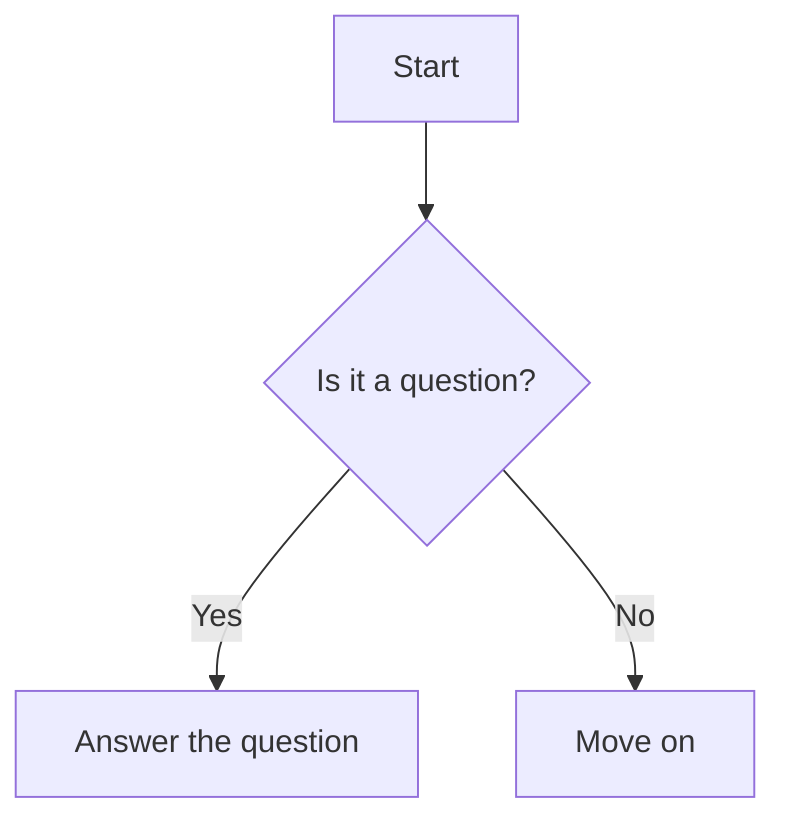

This is the start of the document content.

---

---

# Table of Content h1
## Table of Content h2
### Table of Content h3
#### Table of Content h4
##### Table of Content h5
###### Table of Content h6

[toc]
# Introduction
# Solution {#custom-id}

ivde thoodakkam varanam
# Introduction
ivde preshnam varanam
# A Solution
ivde solution varanam
# Conclusion
ivde conclusion varanam

---

This is a ~~mistaken~~ word.

---

Here's a sentence Term 1 with a footnote.[^1]
Here's another one.[^2]

---

I get a lot of information from [Google][1] and [Wikipedia][2].

---

# My Interactive Document

This is a regular paragraph in Markdown.

<MyInteractiveChart data={myData} />

Here's another paragraph. You can mix and match content easily.

---

X^2^a
X~2

(a + b)^2^ = a^2^ + 2ab + b^2^
H<sub>2</sub>O

---

$$
\frac{-b  \pm \sqrt{b^2 - 4ac}}{2a}
$$

---



---

<details>
  <summary>Click to expand</summary>
    This is the hidden content. It can contain any Markdown-formatted text.
</details>

---

> [!NOTE]
> This is an important note.

> [!WARNING]
> This is a warning. Warnings are for important information that could lead to issues.

sg

---

I'm so happy! 😄

---

Press `<kbd>`Ctrl `</kbd>` + `<kbd>`C `</kbd>` to copy.

---

Term 1
: Definition of the first term.

Term 2
: Definition of the second term, which can span multiple paragraphs.

---

// Fenced code block with line numbers
// The syntax for this varies, but it's often a special keyword.
// e.g.,

```js
function greet(name) {
  console.log(`Hello, ${name}!`);
}
```

---

---

A paragraph with a custom class. { .my-custom-class }

# A heading with an ID

# Heading Text #custom-id
## Another Heading {#another-id}
### Sub Heading {#sub-heading-id}

---

[Go to Introduction](#introduction)

---

> [!QUOTE]
> “The only way to do great work is to love what you do.”
> — Steve Jobs

[1]: https://www.google.com
[2]: https://www.wikipedia.org
[^1]: This is the first footnote.
    
[^2]: This is the second footnote.


